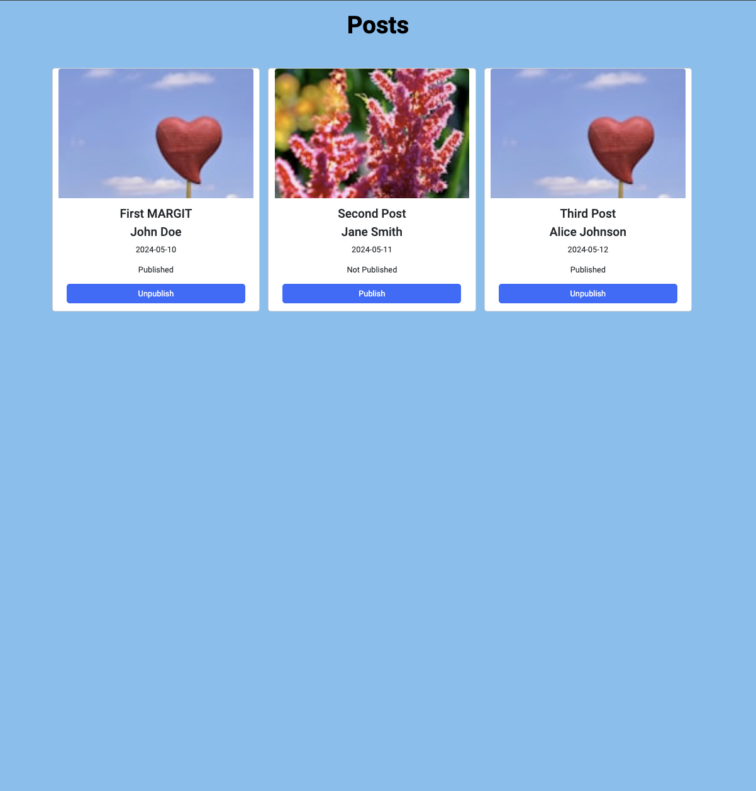

# React Post Update

This web application fetches some posts from db.json file through server api, dislays data in card and updates the publicaiton status by toggle button.

## User Story
+ As a user, I want to toggle the published status between true and false, so I can easily see which posts have been published.
+ As a developer, I want to save these changes to the db.json file, so the updates persist even after refreshing the page.

[&copy;margittennosaar](https://github.com/margittennosaar)

## Preview



## Features

- Fetching data from server api
- Displaying data in card
- Updating data by toggle button

## Getting Started

To get a local copy up and running follow these simple example steps.

### Prerequisites

- Node.js
- npm
- git

### Setup

- Clone the repository

```bash
git clone https://github.com/the-sankari/posts.git
```

```bash
cd posts
```

- Install dependencies

```bash
npm install
```

- Start the applicaiton

```bash
npm run dev
```

- open another terminal
- Start the server

```bash
npm run server
```

- Open `http://localhost:3000/posts/` in the browser the api should be viewed
- Open `http://localhost:5173/` in the browser the application should be viewed

## Tech Stack

- React
- Bootstrap
- Axios

## Asigned by

- [margittennosaar](https://github.com/margittennosaar)

## Author

- [kajolsutradhar](https://github.com/the-sankari)
